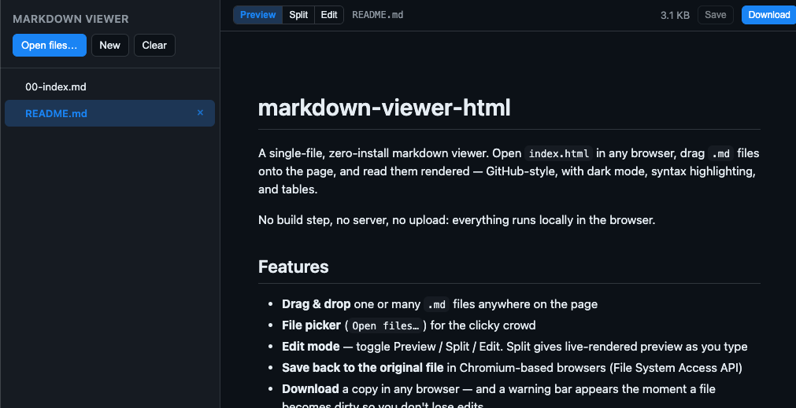

# markdown-viewer-html

A single-file, zero-install markdown viewer & editor. Open `index.html` in any
browser, drag `.md` files onto the page, and read or edit them rendered —
GitHub-style, with dark mode, syntax highlighting, and tables.

**No build step, no server, no network, no upload.** All dependencies (marked,
DOMPurify, highlight.js + theme) are inlined into `index.html`, so the whole
app is one self-contained file you can double-click offline.

## Features

- **Drag & drop** one or many `.md` files anywhere on the page
- **File picker** (`Open files…`) for the clicky crowd
- **Edit mode** — toggle Preview / Split / Edit. Split gives live-rendered preview as you type
- **Save back to the original file** in Chromium-based browsers (File System Access API)
- **Download** a copy in any browser — and a warning bar appears the moment a file
  becomes dirty so you don't lose edits
- **Paste markdown** from the clipboard with <kbd>⌘V</kbd> / <kbd>Ctrl</kbd>+<kbd>V</kbd>
  (outside the editor) as a new file
- **Multi-file sidebar** — stack files, switch between them, close individually; a
  yellow dot marks unsaved ones
- **New** button creates an empty doc to start writing from scratch
- GitHub-flavored markdown: tables, task lists, fenced code blocks, footnotes
- Syntax highlighting (highlight.js)
- Light / dark theme follows your OS
- HTML sanitized with DOMPurify before rendering

## Use

1. Download / clone this repo
2. Double-click `index.html`

Or just open the hosted copy on GitHub Pages (enable Pages → root / main).

## Keyboard shortcuts

| Shortcut | Action |
|---|---|
| <kbd>⌘</kbd>+<kbd>O</kbd> / <kbd>Ctrl</kbd>+<kbd>O</kbd> | Open files |
| <kbd>⌘</kbd>+<kbd>W</kbd> / <kbd>Ctrl</kbd>+<kbd>W</kbd> | Close active file |
| <kbd>⌘</kbd>+<kbd>S</kbd> / <kbd>Ctrl</kbd>+<kbd>S</kbd> | Save (or Save As / Download fallback) |
| <kbd>⌘</kbd>+<kbd>E</kbd> / <kbd>Ctrl</kbd>+<kbd>E</kbd> | Toggle editor |
| <kbd>⌘</kbd>+<kbd>V</kbd> / <kbd>Ctrl</kbd>+<kbd>V</kbd> | Paste markdown as a new file |

## Saving edits

Browser JS can't silently write to your disk, so:

- **Chrome / Edge / Arc / Brave / Opera** (and any Chromium with the File System
  Access API) — when you **Open** files through the picker, the app keeps a
  handle, and **Save** writes the changes straight back to the original file.
  Dragged-and-dropped files *sometimes* also carry a handle (modern Chromium);
  if they do, Save works the same way. The first save prompts for
  write permission.
- **Everywhere else** (Firefox, Safari) — the Save button falls back to a
  download, same as the Download button. The original file is never touched.

A yellow "Unsaved changes" bar appears as soon as you type, and the browser
will warn you if you try to close the tab with unsaved work.

## Dependencies (all inlined)

Every runtime dependency is bundled directly into `index.html`. Nothing is
fetched from the network at runtime — open the file on an airplane, on a USB
stick, behind a firewall, whatever, and it works.

- [marked](https://github.com/markedjs/marked) — markdown → HTML (MIT)
- [DOMPurify](https://github.com/cure53/DOMPurify) — XSS sanitization (Apache-2.0 / MPL-2.0)
- [highlight.js](https://github.com/highlightjs/highlight.js) — syntax highlighting (BSD-3)
- Favicon — an inline SVG data URI (no separate file needed)

The HTML is ~200 KB. To upgrade a dependency, re-download its minified build
and paste it into the corresponding inline `<script>` block.

## License

MIT — see [LICENSE](LICENSE).
