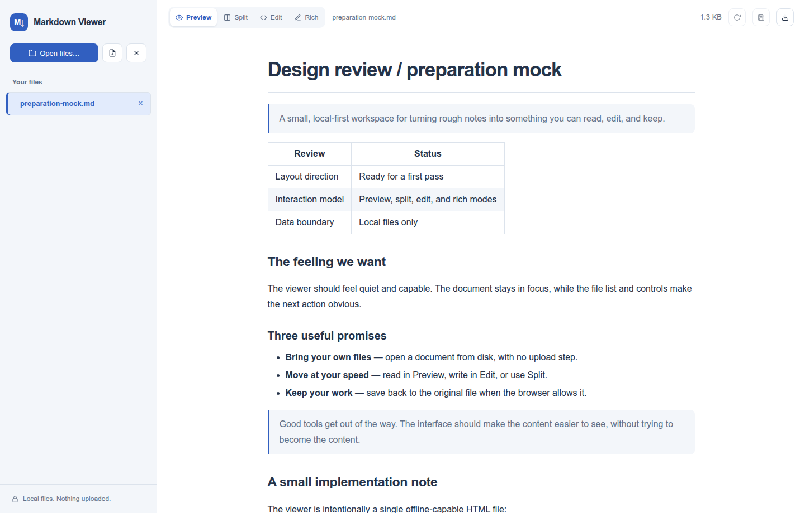

# markdown-viewer-html

A single-file, zero-install markdown viewer & editor. Open `index.html` in any
browser, drag `.md` files onto the page, and read or edit them rendered —
GitHub-style, with dark mode, syntax highlighting, and tables.

**No build step, no server, no network, no upload.** All dependencies (marked,
DOMPurify, highlight.js + theme) are inlined into `index.html`, so the whole
app is one self-contained file you can double-click offline.

### Preparation mock

The repository also includes [`preparation-mock.md`](preparation-mock.md), a small
design-review document that exercises headings, a callout, a table, lists, code,
and task checkboxes in the viewer.

## Features

- **Drag & drop** one or many `.md` files anywhere on the page
- **File picker** (`Open files…`) for the clicky crowd
- **Edit mode** — toggle Preview / Split / Edit. Split gives live-rendered preview as you type
- **Rich editing mode** — edit the rendered document directly, with formatting
  buttons for headings, bold/italic, links, lists, quotes, and code
- **Save back to the original file** in Chromium-based browsers (File System Access API)
- **Reload from disk** for local files opened with a browser file handle, so
  changes made by another editor can be pulled into the tab on request
- **Download** a copy in any browser — and a warning bar appears the moment a file
  becomes dirty so you don't lose edits
- **Paste markdown** from the clipboard with <kbd>⌘V</kbd> / <kbd>Ctrl</kbd>+<kbd>V</kbd>
  (outside the editor) as a new file
- **Multi-file sidebar** — stack files, switch between them, close individually; a
  yellow dot marks unsaved ones
- **New** button creates an empty doc to start writing from scratch
- GitHub-flavored markdown: tables, task lists, fenced code blocks, footnotes
- Syntax highlighting (highlight.js)
- Light / dark theme follows your OS
- HTML sanitized with DOMPurify before rendering

## Use

1. Download / clone this repo
2. Double-click `index.html`

Or just open the hosted copy on GitHub Pages (enable Pages → root / main).

### URL loader (embedding)

When served over HTTP, `index.html?fetch=<url>&name=<display name>` fetches the URL
(repeatable, same-origin or CORS-allowed) and opens the content as a tab — this lets other
tools embed the viewer. Used by Project City (`http://127.0.0.1:8129/` serves this file at
`/mdview` and feeds it project files, including files read from TR over ssh).

## Keyboard shortcuts

| Shortcut | Action |
|---|---|
| <kbd>⌘</kbd>+<kbd>O</kbd> / <kbd>Ctrl</kbd>+<kbd>O</kbd> | Open files |
| <kbd>⌘</kbd>+<kbd>W</kbd> / <kbd>Ctrl</kbd>+<kbd>W</kbd> | Close active file |
| <kbd>⌘</kbd>+<kbd>S</kbd> / <kbd>Ctrl</kbd>+<kbd>S</kbd> | Save (or Save As / Download fallback) |
| <kbd>⌘</kbd>+<kbd>E</kbd> / <kbd>Ctrl</kbd>+<kbd>E</kbd> | Toggle editor |
| <kbd>⌘</kbd>+<kbd>K</kbd> / <kbd>Ctrl</kbd>+<kbd>K</kbd> | Add a link in Rich mode |
| <kbd>⌘</kbd>+<kbd>V</kbd> / <kbd>Ctrl</kbd>+<kbd>V</kbd> | Paste markdown as a new file |

## Saving edits

Browser JS can't silently write to your disk, so:

- **Chrome / Edge / Arc / Brave / Opera** (and any Chromium with the File System
  Access API) — when you **Open** files through the picker, the app keeps a
  handle, and **Save** writes the changes straight back to the original file.
  Dragged-and-dropped files *sometimes* also carry a handle (modern Chromium);
  if they do, Save works the same way. The first save prompts for
  write permission.
- **Everywhere else** (Firefox, Safari) — the Save button falls back to a
  download, same as the Download button. The original file is never touched.

A yellow "Unsaved changes" bar appears as soon as you type, and the browser
will warn you if you try to close the tab with unsaved work.

## Reloading from disk

Use **Reload** to re-read the active file from disk without picking it again.
This works when the browser gives the app a `FileSystemFileHandle`, which is
the normal path for **Open files…** in Chromium-based browsers. Dragged files
may also support it in modern Chromium.

Files opened through plain file inputs, paste, or browsers without the File
System Access API are snapshots, so the Reload button is disabled for those
tabs. If the active file has unsaved edits, Reload asks before replacing them
with the disk version.

## Rich editing

The **Rich** mode edits the rendered document directly and converts the result
back to markdown after each change. It is intended for common GitHub-flavored
markdown: headings, paragraphs, emphasis, links, lists, blockquotes, code
blocks, tables, images, horizontal rules, and task checkboxes.

Because markdown and browser-edited HTML do not map perfectly one-to-one, Rich
mode may normalize spacing or rewrite some source formatting. Use **Edit** mode
when exact source layout matters.

## Dependencies (all inlined)

Every runtime dependency is bundled directly into `index.html`. Nothing is
fetched from the network at runtime — open the file on an airplane, on a USB
stick, behind a firewall, whatever, and it works.

- [marked](https://github.com/markedjs/marked) — markdown → HTML (MIT)
- [DOMPurify](https://github.com/cure53/DOMPurify) — XSS sanitization (Apache-2.0 / MPL-2.0)
- [highlight.js](https://github.com/highlightjs/highlight.js) — syntax highlighting (BSD-3)
- Favicon — an inline SVG data URI (no separate file needed)

The HTML is ~200 KB. To upgrade a dependency, re-download its minified build
and paste it into the corresponding inline `<script>` block.

## License

MIT — see [LICENSE](LICENSE).

## Project structure and design

`index.html` is the canonical, self-contained application. Its first script/style
blocks contain vendored marked, DOMPurify and highlight.js; the final application
style block owns the palette, layout and responsive rules. The body defines the
sidebar, mode controls and editing surfaces. The final script owns in-memory files,
file handles, rendering, rich/source conversion, saves and keyboard shortcuts.
The `welcomeHTML` template and its delegated click handler reuse the existing Open
and New actions. No build or external fonts are required.

Design values live in CSS custom properties (`--bg`, `--fg`, `--accent`,
`--reading-width`, `--ui-radius`); dark colors follow the OS media query.
Below 560px the sidebar becomes a compact top file list and Split stacks vertically.
`icon.svg` is the repository artwork; the application favicon is embedded in the HTML
so copying only that file retains it. Project City's `/mdview` serves this application;
there is no separate viewer source to update.

September 21, 2026 (Kyiv): requested a modest design improvement. Refined the existing
blue workspace, file selection, reading typography, empty-state actions and mobile
layout while retaining offline operation and existing editing modes. Verified in
headless Chrome on the actual file URL: new document, source edits, all four modes,
light/dark desktop and 390px mobile, with no page errors or mobile page overflow.

September 21, 2026 (Kyiv): added `preparation-mock.md` as a reusable visual smoke test
and captured `preparation-mock.png` from the real viewer after opening that file through
the browser file picker. The screenshot is included here so the repository landing page
shows the editor with a representative document open.
